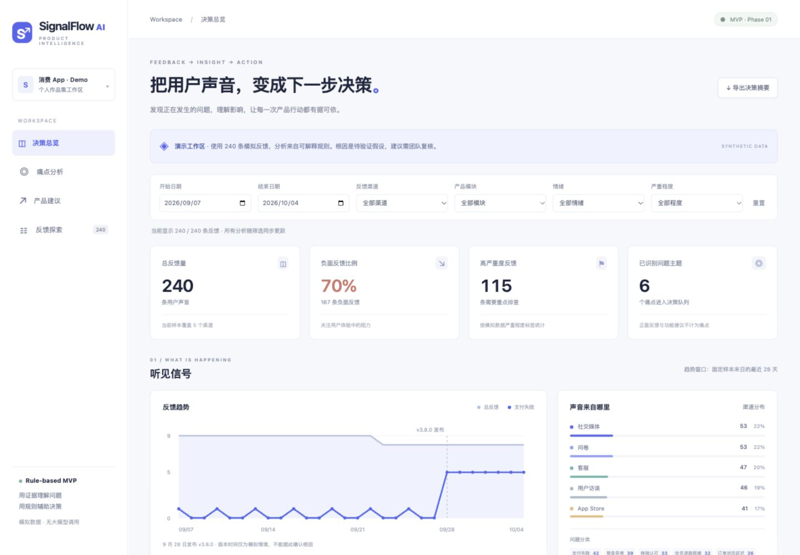

# SignalFlow AI

**从分散的用户反馈，到可追溯的产品决策。**

SignalFlow AI 是面向产品经理、产品运营、用户研究和客户体验团队的产品决策工作台原型，也是一个 AI 产品经理求职作品集项目。长期愿景是 Product Decision Agent；当前仅实现规则驱动的第一阶段。

当前版本：**Phase 1 - Rule-based MVP**（v0.1.0）

当前使用模拟数据、确定性聚合和固定建议模板，没有调用大模型、RAG 或 Agent。产品愿景是连接 Feedback → Insight → Root Cause → Priority → Recommendation → Experiment；第一阶段的根因只作为待验证假设。



[功能与证据](#现在能做什么) · [本地运行](#本地运行) · [能力边界](#真实逻辑与模拟边界) · [Roadmap](#roadmap) · [GitHub 发布指南](docs/GITHUB_SETUP.md)

## 项目概览

| 项目 | 说明 |
| --- | --- |
| 目标用户 | 产品经理、运营、用户研究和客户体验团队 |
| 当前输入 | 240 条带预置标签的模拟消费 App 反馈 |
| 当前输出 | 问题聚合、趋势、可解释优先级、证据和模板建议 |
| 产品价值 | 减少分散反馈的整理成本，提供可讨论、可追溯的决策依据 |
| 技术方案 | 原生 HTML / CSS / JavaScript + JSON；Python 标准库静态服务器 |
| AI 状态 | 尚未实现 LLM、RAG、Agent；产品名称不代表已具备模型能力 |

## 功能截图

已有总览截图位于 `docs/preview.jpg`，上方图片使用仓库相对路径引用。
痛点证据、产品建议、反馈探索和手机布局的截图位置预留在 [`docs/screenshots/`](docs/screenshots/README.md)。这些补充截图尚未添加；现有截图来自首版页面，版本文字详见截图说明。

## 为什么需要它

评论、客服、问卷和访谈分散在不同渠道，团队难以判断哪些问题最值得处理，以及判断依据是什么。本项目把「正在发生什么」「为什么值得关注」「接下来做什么」呈现在一个工作台中，并保留原始反馈 ID、渠道和日期作为证据。

## 现在能做什么

- 总反馈量、负面比例、高严重度反馈数量、问题主题数量。
- 28 天反馈趋势、支付失败趋势、新版本发布时间标注、渠道分布和问题分类。
- 按开始 / 结束日期、渠道、产品模块、情绪、严重程度筛选；按原文、ID、平台、用户群或问题名称搜索。
- 痛点数量、占比、最近两周变化、主要用户群、主要平台、P0 / P1 / P2 优先级。
- 展开每项分数的计算依据，以及最多 5 条完整原始反馈。
- 为优先级最高的三个主题展示排查建议、待验证假设、协作团队、实验方法和验证指标。
- 分页浏览全部反馈；导出当前筛选的 Markdown 决策摘要（包含所有痛点）。
- 自适应桌面和手机布局；空结果、日期倒置、数据加载失败提示。

## 本地运行

不需要 npm install、数据库或 API 密钥。Python 仅提供静态网页服务，分析在浏览器运行。

1. 打开「终端」。
2. 下载或克隆仓库后，进入项目目录。假设文件夹名是 `signalflow-ai`，在它的上级目录执行：

```bash
cd signalflow-ai
python3 server.py
```

3. 看到 `SignalFlow AI: http://localhost:8000` 后，在浏览器打开 **http://localhost:8000**。
4. 保持终端运行；停止时在终端按 **Control + C**。

如果提示端口被占用：

```bash
python3 server.py --port 8001
```

改为打开 http://localhost:8001。服务器仅监听本机，不会发布到互联网。

如果终端提示没有 Python，需准备 Python 3.9 或更高版本；不要双击 `index.html`：直接打开文件时浏览器可能拦截模块和 JSON 加载。如果下载的目录名为 `signalflow-ai-main`，或路径中有空格，把 `cd` 后的目录替换为实际路径并加上引号。Windows 可使用 `py -3 server.py`。

## 三分钟演示路线

1. 看顶部四项指标和支付趋势，说明样本为 240 条模拟反馈。
2. 看支付失败卡片：42 条反馈，近一周 35 条、前一周 2 条，优先级 94 分。
3. 点击「优先级如何计算」「查看分数依据」，解释为什么排在第一。
4. 展开「查看原始证据」，展示反馈 ID、原文、渠道、平台与版本。
5. 看行动区，明确区分事实、假设、建议及验证方法。
6. 筛选「客服」或「支付」，观察所有统计同步变化；点击重置。
7. 搜索 `FB-0236` 追溯单条反馈，或导出摘要供团队评审。

百分比四舍五入。支付增长 +1650% 来自 2 → 35 条的小基数，不能只看增长百分比；它是人为设计的演示信号。

## 项目结构与每个文件的作用

```text
SignalFlow AI/
├── index.html                 网页各个区域和表单的骨架
├── server.py                  Python 标准库本地服务器
├── README.md                  产品说明、运行步骤、规则和路线图
├── package.json               项目元信息与可选 Node 测试命令；无 npm 依赖
├── .gitignore                 忽略缓存、环境配置、凭证和本地导出
├── .gitattributes             跨系统文本换行与图片二进制规则
├── data/
│   └── feedback.json          240 条模拟反馈及样本元信息
├── docs/
│   ├── preview.jpg            浏览器实测桌面截图
│   ├── GITHUB_SETUP.md        建仓、认证、提交与推送说明
│   └── screenshots/README.md  功能截图位置和补充规范
├── scripts/
│   └── generate_data.py       用固定随机种子重新生成模拟反馈
├── src/
│   ├── styles.css             配色、布局、卡片与响应式样式
│   ├── app.js                 读取数据、交互、绘图、分页、证据和导出
│   ├── analysis.js            筛选、聚合、两周比较、优先级和建议规则
│   └── ai/
│       └── README.md          后续 AI 接入边界说明（没有 AI 实现）
└── tests/
    └── analysis.test.js       数据完整性与关键决策规则测试
```

HTML 决定「有什么」，CSS 决定「长什么样」，JavaScript 决定「点击后发生什么」，JSON 保存反馈。分析模块不依赖网页，后续可保留聚合逻辑并接入模型分类结果。

## 模拟数据说明

虚构产品：具备支付、会员、搜索、登录、订单、通知功能的消费 App。

- 240 条；固定周期 2026-09-07 至 2026-10-04；随机种子 42。
- 五个渠道：App Store、客服、问卷、社交媒体、用户访谈。
- 四类用户：新用户、活跃用户、付费用户、流失风险用户。
- 平台：Android / iOS；版本：3.7.2 / 3.8.0。
- 八类标签：六种问题、体验认可、功能建议。正面和建议类仍展示在反馈表和分类中，六种问题进入痛点队列。
- 9 月 28 日模拟发布 3.8.0；发布后一周每天 5 条 Android 支付失败反馈，共 35 条，前一周 2 条。
- 文本包含短句、情绪表达和上下文，但由有限文案变体组合，会出现重复，不是真实用户研究样本。

每条包含：`feedback_id`、`date`、`channel`、`user_segment`、`platform`、`app_version`、`product_area`、`feedback_text`、`sentiment`、`issue_category`、`severity`。

重新生成（覆盖 JSON 文件，固定种子可复现）：

```bash
python3 scripts/generate_data.py
```

## 从一条反馈到一项决策

以「用优惠券结账一直提示校验失败」为例：

1. JSON 中保留原文和 ID；情绪、类别、严重程度是生成数据时预置的标签。
2. 按用户选中的条件保留样本，归入「支付失败」组。
3. 计算同组数量、在全部筛选反馈中的占比、负面比例、高严重度比例、主要用户群和平台。
4. 对固定的最近 7 天与前 7 天计算增长。
5. 根据下述公式打分和排序。
6. 根据问题类型选取规则模板；没有新版 Android 证据时，支付建议退回一般支付排查。
7. 返回原始证据、待验证假设、建议动作、实验和指标。负责人、建议和实验为固定模板，尚未执行。

**重要：当前没有读取文字后自动分类。** 分类、情绪和严重程度来自模拟数据字段；真实实现的是这些标签上的筛选、统计、排序和证据关联。后续需引入人工标注或 LLM 分类，才能处理没有标签的新反馈。

## Priority Score：容易解释的样本优先级

对当前筛选内每个问题，计算 0–100 分，最终四舍五入：

| 因素 | 分数 | 计算 |
| --- | ---: | --- |
| 反馈量 | 25 | `25 × min(相关反馈数 / 40, 1)` |
| 负面比例 | 25 | `25 × 负面反馈数 / 相关反馈数` |
| 高严重度比例 | 25 | `25 × 高严重度反馈数 / 相关反馈数` |
| 近期增长 | 15 | `15 × clamp(增长率, 0, 1)` |
| 用户影响 | 10 | `10 × (付费用户数 + 流失风险用户数) / 相关反馈数` |

- P0：≥75；P1：≥50 且 <75；P2：<50。它是演示样本里的排查顺序，**不是线上事故等级，也不是经过校准的业务模型**。
- 增长率 = `(最近7天数 - 前7天数) / 前7天数`。
- 前期为 0、近期有反馈：显示「新增」，增长项为 15 分；两期均 0 为 0 分。下降不扣分，增长项为 0。
- 比较窗口固定在样本末日：2026-09-28 至 2026-10-04，对比 2026-09-21 至 2026-09-27。不是随电脑时间滚动。
- 所有筛选与搜索同时作用于 Dashboard、图表、痛点、建议、表格及导出。日期不覆盖完整两周时会显示提示，此时增长只反映保留样本，不是完整周环比。
- 占比以当前筛选总反馈量为分母，包含正面和功能建议；严重度以高严重度比例展示。
- 样本量不是实际受影响用户数；没有独立用户 ID 或活跃用户分母，无法计算真实事故发生率。渠道可能有选择偏差。
- 权重及 40 条阈值是可解释的 MVP 假设，未来须和人工排序、业务损失等对照验证。

## 真实逻辑与模拟边界

| 内容 | 当前状态 |
| --- | --- |
| 多渠道反馈、情绪、分类、严重程度和版本情境 | 模拟、预置；未接入真实渠道 |
| 筛选、聚合、增长计算、评分和排序 | 真实运行的本地规则 |
| 原始证据 | 可回溯到 JSON 原始记录，但原始记录本身是模拟 |
| 根因 | 固定模板中的待验证假设；不能当事实 |
| 产品建议、团队、实验与指标 | 按问题标签选择模板；不是 AI 推理或执行结果 |
| 支付成功率等指标 | 仅提出验证方向，没有实际日志、漏斗或实验结果 |
| LLM / RAG / Agent / Tool Calling / SQL / 多模态 | 尚未实现 |

## 如何验证

可选：有 Node.js 18 或更高版本时运行（运行网页不需要 Node）：

```bash
node --test tests/analysis.test.js
```

自动测试覆盖模拟字段完整性、支付场景与优先级、筛选组合、空结果、正面反馈不生成痛点、零基数增长、下降时的分数。已通过 7 项自动测试；浏览器另外检查了筛选同步、证据展开、分页、空搜索和桌面 / 手机布局。摘要下载的内置浏览器自动验证超时，下载交付尚未完成验证。未建立生产环境测试或真实用户指标。

## Roadmap

**优先做 LLM Classification，同时建立小型 Evaluation 标注集。**

当前最大的人工前提是「反馈已带标签」。语言模型的增量价值是理解自然语言、混合意图和不同措辞，把未标注文本转换为可聚合的结构化标签。应保留人工复核、原始证据和低置信度兜底，聚合及分数继续用规则，避免模型随意修改数字。

建议先人工标注一批独立样本，对照当前基线，测分类准确度 / macro-F1、严重问题召回率、人工修正率、单条成本与延迟。当前生成标签不能自动当高质量评测真值，后续需要真实脱敏样本或独立人工审核。

以下为规划，不代表已经实现，也不承诺上线时间：

| 阶段 | 状态 | 范围 | 验证目标 |
| --- | --- | --- | --- |
| Phase 1 - Rule-based MVP | 已实现 | 模拟数据、聚合、趋势、优先级、证据、模板建议 | 本地可复现，计算可解释；当前自动测试与浏览器检查见上文 |
| Phase 2 - LLM Classification + Evaluation | 未实现 | 文本分类、情绪与严重度识别；独立标注集、置信度与人工复核 | 对照基线测 macro-F1、严重问题召回率、人工修正率、成本与延迟 |
| Phase 3 - RAG | 未实现 | 检索版本说明、产品文档及历史处理记录，附来源 | 验证检索命中、引用准确度与缺证据时的拒答 |
| Phase 4 - Tool Calling / SQL Tool | 未实现 | 在具备真实日志及数据源后查证业务指标 | 验证查询结果、权限边界及结论中的数字一致性 |
| Phase 5 - Agent Workflow | 未实现 | 多步分析、工具协调、人工确认与审计记录 | 对照人工流程评估决策质量、任务成功率与失败恢复 |
| Multimodal | 需求明确后再评估，未实现 | 必要时处理截图或录音 | 验证提取准确度与相对文本流程的收益 |

不需要用 AI 做精确计数、趋势、分数、筛选或分页。信任来自可追溯证据、区分事实与推断、展示不确定性，以及可以验证的实验。本次仅完成第一阶段。


## 发布到 GitHub

建议仓库名：`signalflow-ai`。推荐 Description：

> An explainable product decision dashboard using synthetic feedback. Phase 1 - Rule-based MVP.

按 [GitHub 发布指南](docs/GITHUB_SETUP.md) 创建空的 Public 仓库，再初始化 Git、提交并推送。项目仓库：[FelixJiachengGong/signalflow-ai](https://github.com/FelixJiachengGong/signalflow-ai)。当前没有部署在线服务。

`package.json` 中的 `private: true` 用于避免误发 npm 包，不影响 GitHub 仓库设为 Public。当前没有指定开源 LICENSE；许可条款可后续单独决定。
